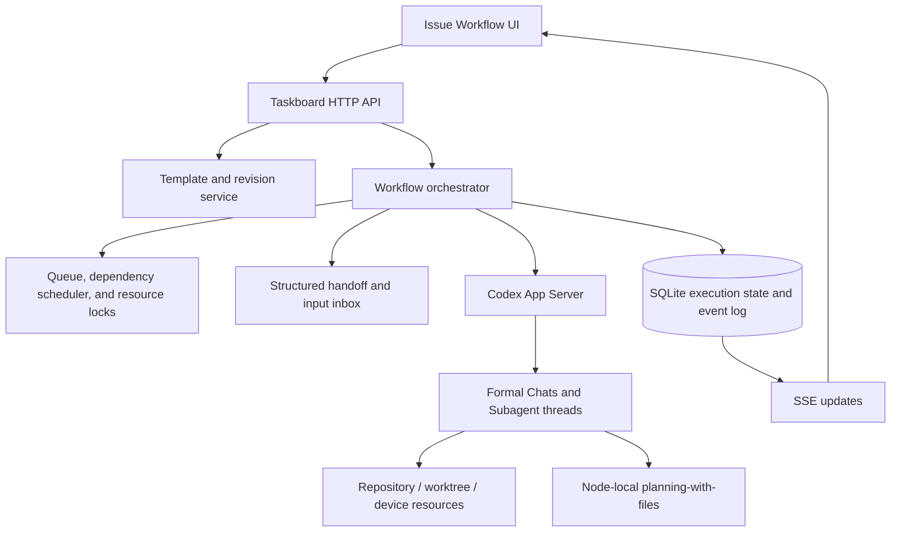

# Codex Thread Orchestrator Design

## Status

Approved in conversation on 2026-08-07.

## Decision

Build a Taskboard-native Codex thread orchestrator by extending the existing workflow implementation. Reuse the MIT-licensed `@xyflow/react` canvas, current workflow domain code, SQLite/SSE infrastructure, and Codex App Server thread controls. Do not fork Multica, build a diagram engine, or deploy a general-purpose workflow platform for the first version.

The product is not a generic automation canvas. It is a durable, inspectable, and interruptible execution layer for long Codex work:

> Split one long task into bounded Chats, pass structured context between them, continue unattended, and let the user intervene without losing the execution history.

## Problem

The current manual workflow has four failure modes:

- A single Chat accumulates too much context, slowing execution and reducing accuracy.
- Discoveries made during a long turn are difficult to inject without interrupting or manually opening another Chat.
- Ordered or dependency-based follow-up work depends on Prompt instructions such as “create another Chat when finished.”
- When the user is away from the computer, there is no durable scheduler proving what finished, what is waiting, and what should run next.

Natural-language handoff instructions are useful but are not a workflow engine. They can be forgotten, repeated, misaddressed, or lost across restarts.

## Product Outcome

A real Issue can run through this path:

```text
Select template
  -> Codex generates a constrained graph
  -> deterministic validation
  -> independent Codex review
  -> user manually enqueues an immutable run snapshot
  -> planning Chat
  -> implementation Chat
  -> independent verification Chat
  -> Taskboard-local confirmation
  -> explicit Issue Action
```

The user can inspect every formal Chat and Subagent, steer a running turn, queue another message for the same Chat, or append a new formal task. The scheduler resumes after a service restart without re-running completed work.

## Confirmed First-Version Scope

- Each workflow instance has one primary Issue.
- Editable, duplicable, independently versioned workflow templates.
- Constrained dynamic topology: templates define the skeleton, allowed node types, and graph rules; Codex may insert, remove, reorder, or add limited conditions before review.
- No arbitrary cycles. Retry is an explicit bounded runtime operation.
- Default automatic progression after success and pause after failure.
- Per-node option to wait for Taskboard-local user confirmation.
- Manual enqueue after a workflow revision becomes `ready`.
- Independent planning and review Chats.
- Separate formal Codex Thread nodes for bounded workflow stages.
- Visible Subagent child nodes inside expandable formal-node subgraphs.
- Structured handoffs instead of full Chat-history injection.
- User-only immediate steering and durable queued Chat messages.
- Append-only formal-task amendments during an active run.
- Dependency-aware parallelism with concurrency limits and resource locks.
- Per-workflow model/effort defaults, node recommendations, Codex suggestions, and user overrides.
- Explicit `Issue Action` nodes for Issue mutations.
- Database-first persistence, event history, restart reconciliation, and attempt history.

## Non-Goals

- No general Zapier, n8n, or Multica replacement.
- No free-form arbitrary graph or unrestricted loop generation.
- No template inheritance or automatic propagation between copied templates.
- No full transcript copy between workflow nodes.
- No direct peer-to-peer Chat execution or unmediated Agent-to-Agent steering.
- No automatic reopening or rewriting of completed workflow history.
- No Feishu notification or Feishu approval in the first version.
- No timers, webhooks, CI callbacks, file watchers, or general external-event waits.
- No remote notification guarantee while the user is away from the computer.
- No cloud-synchronized execution runtime in the first version. Execution state remains a local-companion concern even when the primary Issue uses cloud persistence.
- No new generic workflow service dependency.

## Existing Operation Path

The feature extends existing product paths instead of creating a parallel application:

1. `web/src/components/WorkflowBoard.tsx` already renders a hidden React Flow workflow editor with custom nodes and deterministic layout.
2. `shared/workflow-control-flow.mjs` and `shared/workflow-sequence.mjs` already own constrained control-flow semantics independently of the renderer.
3. Workflow workspaces already persist through the local HTTP service with optimistic versions and SSE/revision refresh.
4. `server/ai-chat.mjs` currently starts and resumes Codex sessions through `codex exec --json`, demonstrating the existing browser-to-server-to-Codex path.
5. Codex App Server adds the required durable thread lifecycle and active-turn controls: `thread/start`, `thread/resume`, `thread/read`, `turn/start`, `turn/steer`, and `turn/interrupt` plus thread/turn/item events.
6. `server/database.mjs` already provides SQLite transactions and optimistic concurrency for local business writes.

The implementation should preserve these ownership boundaries. The iframe remains unprivileged; Codex-native “open Chat” behavior uses the existing narrow host bridge only when Taskboard is embedded.

## Architecture



### Ownership Rules

- Taskboard decides what may run, when it may run, and what becomes runnable next.
- Codex App Server owns thread and turn execution.
- SQLite is the authoritative source for workflow, node, attempt, inbox, lease, and event state.
- `planning-with-files` is Agent-readable working memory, not the concurrent scheduler database.
- The graph is a projection of persisted state. The browser never infers authoritative state from streamed Chat text.
- Chats never directly call one another. All cross-Chat messages pass through the orchestrator inbox.

## Reuse Strategy

### Reuse

- `@xyflow/react` for rendering, selection, viewport, and graph interaction.
- Existing `WorkflowBoard`, custom workflow nodes, inspector patterns, layout, and catalog discovery.
- Existing pure workflow modules for validation and deterministic control flow.
- Existing SQLite, optimistic version, SSE, API, and cloud-proxy patterns.
- Codex App Server for durable thread lifecycle, events, compaction visibility, steering, and interruption.
- Existing `taskctl`/Skill integration pattern for narrow Agent-originated workflow messages.

### Build In Taskboard

- Template revisions and immutable run snapshots.
- Planner and independent Reviewer orchestration.
- Node-run and attempt state machines.
- Durable input inboxes and completion barriers.
- Dependency scheduling, leases, resource locks, and restart reconciliation.
- Structured handoff generation and validation.
- Append-only run amendments.
- Workflow graph status projection and node controls.

### Do Not Reuse As A Product Base

Do not fork Multica. Its platform/runtime boundary would replace rather than extend Taskboard, while still requiring custom Codex thread, Issue, local workspace, queue, and recovery semantics. A generic durable workflow engine is also deferred: it would add a substantial local deployment dependency without removing the need for the Taskboard-specific runtime contract.

## Core Records

The exact SQLite table layout belongs in the implementation plan, but the runtime requires these distinct concepts:

| Record | Responsibility |
| --- | --- |
| Workflow template | Editable reusable graph definition and constraints |
| Template revision | Immutable reviewable template snapshot |
| Workflow run | One primary-Issue execution of an immutable graph snapshot |
| Node run | Persisted state of one formal graph node |
| Node attempt | One execution try; retry never overwrites prior attempts |
| Thread binding | Formal Chat or Subagent thread ID associated with a node/attempt |
| Inbox message | Persisted steer or queued message with source, target, order, and delivery status |
| Handoff | Structured predecessor output and artifact references |
| Resource lease | Exclusive or shared ownership of a worktree, device, or environment |
| Workflow event | Append-only observable transition and audit record |
| Run amendment | Append-only user-authorized graph change for unexecuted downstream work |

## Version Semantics

Do not overload one `version` field:

| Version | Purpose |
| --- | --- |
| Optimistic `version` | Detect concurrent record writes, following current API conventions |
| Template `revision` | Identify immutable reviewable template history |
| Graph `schemaVersion` | Migrate serialized graph structure |
| Node `executorVersion` | Detect incompatible execution-contract changes |

Enqueue stores the source template revision, complete graph snapshot, graph schema version, and node executor versions. Template edits never mutate queued, active, or historical runs.

Old graph schemas may migrate on load. If a queued or active node uses an unsupported executor contract, it enters an explicit migration-required pause rather than silently running with changed semantics. The first version does not promise indefinite retention of every historical executor implementation.

## Template Lifecycle

```text
draft -> reviewing -> ready -> manually enqueued as a run snapshot
            |           |
            +-> draft <-+-- edit creates another revision
```

- Codex generation produces a draft constrained by the selected template rules.
- Deterministic validation checks node schemas, dependencies, allowed topology, permissions, and cycle rules.
- An independent Reviewer Chat checks goal alignment, omissions, and risk.
- The Reviewer can pass or request revision; it cannot mutate the submitted graph directly.
- `reviewing` revisions cannot enter the queue.
- The user's manual enqueue is the final execution authorization.
- Duplicating a template creates an independent template. There is no parent-child inheritance.

## Node Types And Presets

Use stable execution primitives plus reusable presets:

| Primitive | First-version behavior |
| --- | --- |
| Codex Thread | Start or resume one formal Chat with configured role, model, effort, permissions, cwd, and output schema |
| Human Gate | Wait for Taskboard-local approval after releasing execution resources |
| Condition | Select an allowed branch from structured predecessor output |
| Issue Action | Perform an explicit optimistic Issue mutation with idempotency protection |

Planning, implementation, testing, review, security review, and similar roles are presets of `Codex Thread`, not separate executor types.

Subagents are runtime child threads, not peers in the formal graph. They appear in the expanded parent-node subgraph. A parent node cannot complete while any Subagent remains active. Work that must outlive its parent, own independent dependencies, or require separate confirmation is promoted to a formal node.

Every executable node may set `approvalMode` to automatic or manual. Manual mode places that node in `awaiting_confirmation` after successful execution. The explicit `Human Gate` primitive is reserved for a named checkpoint that covers multiple predecessors or exists independently of one executor's output.

## Model And Permission Resolution

Configuration resolves in this order:

1. Workflow default model and reasoning effort.
2. Node-type or role-preset recommendation.
3. Visible Codex-generated override suggestion.
4. Explicit user node override.

The resolved model, effort, cwd, sandbox, and permissions are visible before enqueue and on the running node. Arkkey quota is not an optimization constraint; the default policy optimizes latency and result quality. High reasoning should be reserved for ambiguous planning, implementation, and independent review rather than applied to every supporting node.

## Run And Node States

### Workflow Run

A run is `queued`, `running`, `paused`, `completed`, `failed`, or `cancelled`. Its visible state is derived from persisted node state and explicit run controls, not from Chat output.

### Node Run

```text
blocked -> ready -> running -> awaiting_confirmation -> succeeded
                     |                |
                     |                +-> rejected
                     +-> failed
                     +-> interrupted
                     +-> recovery_required
                     +-> migration_required
                     +-> cancelled
```

- `blocked`: at least one required dependency is incomplete.
- `ready`: dependencies are satisfied; the node is waiting for capacity and resources.
- `running`: a lease is held and the Chat, inbox, or child Subagents are active.
- `awaiting_confirmation`: output is stored and execution resources are released; downstream nodes remain blocked.
- `succeeded`: output is valid, confirmation is satisfied, and successors may be evaluated.
- `rejected`: the user declined the candidate result; successors remain blocked until an explicit retry or appended task.
- `failed`: the attempt ended unsuccessfully.
- `interrupted`: the user stopped the active turn; retry creates a new attempt.
- `recovery_required`: restart reconciliation cannot prove whether execution completed.
- `migration_required`: the run snapshot references an unsupported graph or executor contract.
- `cancelled`: the user ended the node without success.

`turn/steer` does not change node or attempt state. It appends input to the active turn. `turn/interrupt` ends the current attempt as interrupted.

## Input Semantics

The node composer exposes three distinct operations.

### Immediate Guidance

- Available only to the user in the first version.
- Persist the input before delivery.
- Call `turn/steer` with the active `expectedTurnId`.
- It remains part of the current attempt and does not create a turn, Chat, or graph node.
- “Immediate” means accepted into the in-flight turn. A long-running tool call may delay the model's reaction until the next processing boundary.
- If the turn ends before steer delivery succeeds, retain the input as a queued message.

### Queued Message

- Persist in the target formal node's inbox.
- Starts a new turn in the same Chat immediately after the current turn completes.
- Preserves FIFO order and source attribution.
- May come from the user or another Chat through an orchestrator-mediated API/client command.
- Does not create a formal task or modify the graph.
- Automatic context compaction does not change the target Chat. Later queued messages continue in the same compacted thread.
- Every turn uses the formal node's output schema. The latest successful turn must return an updated result envelope; earlier turn outputs remain event history, while the last valid envelope becomes the candidate node result after the inbox drains.

### Formal Task

- Creates a new workflow node with an independent Chat, dependencies, attempts, model, resource policy, and result.
- During an active run, it is an append-only run amendment.
- A fully configured user-authored node needs deterministic validation and explicit confirmation only.
- A natural-language request that asks Codex to generate the amendment also requires independent Reviewer approval.
- The first version may append only unexecuted downstream work. It cannot alter running nodes, delete dependencies already consumed, or rewrite completed history.

Only explicit “continue in new Chat” or formal-task creation opens another Chat. Queued messages never do so automatically.

## Completion Barrier

A formal node may leave `running` only when all of these are true in one authoritative database transition:

- no active Codex turn;
- inbox is empty;
- all child Subagents are terminal;
- required structured output is present and schema-valid;
- no unresolved delivery or recovery state exists.

When a turn completes, the orchestrator first persists the event, then checks the inbox. If a queued message was committed before the completion transition, it starts another turn in the same Chat and the node remains `running`. A message submitted after the node becomes terminal cannot reopen history; it must become a formal task amendment.

## Structured Handoff

Successor formal Chats receive a minimal immutable handoff:

- primary Issue and workflow goal;
- node objective and role;
- relevant predecessor conclusions;
- changed files and artifacts;
- validation evidence;
- unresolved questions and known risks;
- source Chat, node, attempt, and event references;
- allowed on-demand paths to original Chats, files, and planning memory.

Full Chat transcripts are never injected by default. A successor may read cited source material on demand. Each Chat owns its own `planning-with-files` session; Taskboard remains the authority for shared run state.

The workflow may expose a shared `planning-with-files` projection for Agent readability, but the orchestrator is its only writer. It is regenerated from persisted run state and handoffs. Node-local planning sessions may read or reference that projection; they never coordinate by concurrently editing it.

## Scheduling And Concurrency

- A node becomes eligible only when all required dependencies satisfy its branch rules.
- Eligible nodes execute concurrently up to the workflow limit; the conservative default is two.
- Every executable node declares resource requirements such as workspace read, workspace write, worktree, test device, or deployment environment.
- Read-only independent nodes may overlap.
- Nodes that write the same workspace serialize unless they use isolated worktrees.
- A scheduler lease and all required resource locks must be persisted before `turn/start`.
- The same formal node keeps its resource ownership while immediately draining already-queued messages.
- Resources are released before waiting for user confirmation.
- Model concurrency and resource concurrency are separate limits.

## Failure Propagation And Retry

- By default, a failed node pauses itself and dependent descendants. Independent branches continue.
- A workflow-level fail-fast setting pauses the whole run on any node failure.
- Retry creates a new attempt; it never overwrites the old attempt, Chat, events, or artifacts.
- The user may steer an active attempt or interrupt and retry it.
- Rejected confirmation moves the node to `rejected` and requires an explicit retry or appended task.
- Retry reacquires scheduler capacity and all required resources.

`Issue Action` and other side-effecting executors use an idempotency key derived from run, node, and attempt identity. Issue mutations carry the latest optimistic `version`; a conflict pauses the node instead of overwriting another writer.

## Restart Recovery

On service start, the orchestrator loads authoritative nonterminal runs from SQLite and reconciles each active thread with Codex App Server:

- active thread/turn: reattach event subscriptions and continue;
- completed turn with a missed local terminal event: read the authoritative result and persist the missing transition;
- interrupted or failed turn: reflect that terminal attempt state;
- missing thread or ambiguous execution outcome: mark `recovery_required`;
- completed node: never start again merely because its old lease expired.

The runtime does not automatically retry an ambiguous execution because that could duplicate code or Issue side effects.

## Context Compaction

Codex automatically compacts history at its configured/model threshold and emits a `contextCompaction` item. Taskboard records and displays this event.

Compaction remains inside the same Chat. It does not create a continuation Chat or reroute queued messages. Automatic rollover after repeated compactions is a possible future experiment, not first-version behavior. The user can always create an explicit formal follow-up task when a new bounded Chat is preferable.

## Graph Presentation

The main graph shows formal workflow nodes and dependencies. A formal Codex node displays:

- role and node type;
- resolved model and reasoning effort;
- status and active attempt;
- Chat/thread identity;
- active-turn and queued-message counts;
- resource ownership;
- Subagent count and aggregate state;
- confirmation, failure, or recovery state.

Expanding the node reveals a child graph of all Subagent threads and their status, model, activity, and result. Promoting a Subagent creates a formal downstream node; it does not merely restyle the child.

## Product Experience

### Issue Workflow Tab

The primary entry point is a `Workflow` tab in the owning Issue. It contains:

- template selector;
- template revision and review status;
- review report;
- manual enqueue action, disabled while reviewing;
- main workflow graph;
- running/queued/failure summary;
- node inspector.

### Node Inspector

The inspector contains:

- runtime state, model, effort, thread ID, and “open Chat” action;
- Inbox, Attempts, and Subagents tabs;
- segmented composer modes: `立即引导`, `下一轮消息`, and `新增任务`;
- activity and event history;
- interrupt, retry, cancel, approve, and reject controls as applicable.

When embedded in Codex, “open Chat” uses the narrow host action. Standalone Taskboard displays persisted activity and thread metadata without depending on native navigation.

### Template Library

Users can create, duplicate, rename, edit, and keep multiple independent templates. Template copies do not receive upstream changes. Stable execution primitives and role presets provide the extension boundary; new external integrations require explicit executor implementations.

## Local And Cloud Boundary

Codex execution, thread IDs, local workspace paths, leases, inbox delivery, planning paths, and recovery state belong to the local companion. They must not be double-written to D1 or treated as cloud business records in the first version.

An `Issue Action` against a cloud-backed primary Issue uses the existing cloud proxy/business mutation path and optimistic Issue version. The local run records the action result. Another device does not take over an active local workflow run.

## Security And Safety Boundaries

- Keep Codex App Server and execution APIs loopback-local.
- Do not expose raw thread-control methods directly to the iframe.
- Validate every graph, node configuration, run amendment, target node, and actor at the HTTP boundary.
- Agent-originated inbox writes are limited to nodes in the same allowed workflow context and are always queued.
- Do not let a Chat steer another active Chat in the first version.
- Do not hold worktree/device resources while waiting for human confirmation.
- Never infer that an external side effect failed merely because its response event was missed; reconcile before retry.

## Direct Operation Path

1. The user opens an Issue and selects a workflow template.
2. The browser requests graph generation from the local service.
3. A Planner Chat returns a schema-constrained graph.
4. Deterministic validation runs, followed by an independent Reviewer Chat.
5. A passing revision becomes `ready` and remains inert.
6. The user manually enqueues it.
7. One transaction stores the immutable graph snapshot, run, node runs, and initial ready set.
8. The scheduler leases a ready node, acquires resources, builds its handoff, starts the Codex thread/turn, and stores the returned IDs.
9. Codex events are persisted before SSE updates the graph.
10. User steer, queued messages, Subagent activity, and attempts appear under the formal node.
11. The completion barrier validates the final output and releases successors.
12. An explicit Human Gate and Issue Action finish the demonstrated workflow.

## First-Version Verification

Demonstrate one real Issue through the complete operation path:

1. Select a template, generate a graph, and prove deterministic plus independent Codex review.
2. Confirm a `reviewing` revision cannot be enqueued and a `ready` revision can.
3. Manually enqueue and observe separate planning, implementation, and verification Chats.
4. During implementation, send one user steer, one queued message, and one Agent-originated queued cross-Chat message. Confirm all sources and ordering are visible.
5. Spawn parallel read-only Subagents and confirm they appear as expandable child nodes and block parent completion while active.
6. Confirm independent eligible work runs in parallel while same-workspace writes serialize.
7. Interrupt one attempt and retry it. Confirm the old attempt remains visible.
8. Fail one branch and confirm only dependent descendants pause unless fail-fast is enabled.
9. Restart the local service during an active run. Confirm it reconciles the existing thread and does not rerun completed nodes.
10. Complete Taskboard-local confirmation and explicit Issue Action, then observe the final Issue and graph state.
11. Run `npm run typecheck`, the production build, and diff whitespace checking for the implementation change.

Following project policy, the first implementation should prove this direct path before adding speculative compatibility layers or automated regression protection. Additional tests require explicit user approval or a concrete failure that needs protection.

## Risks And Controls

| Risk | Control |
| --- | --- |
| Graph looks transparent while a large node still drifts | Bounded formal Chats, visible attempts, user steer, and independent verification |
| Too many small Chats increase setup time | Role presets and structured handoffs; formal tasks only for independent lifecycle |
| Queued messages recreate one oversized Chat | Codex compaction remains visible; user can explicitly create a bounded formal follow-up task |
| Multiple writers corrupt the workspace | Dependency-aware resource locks and worktree isolation |
| Planner approves its own mistaken assumptions | Independent Reviewer Chat plus manual enqueue |
| Retry duplicates side effects | Attempt history, idempotency keys, and recovery reconciliation |
| Runtime upgrade changes old behavior | Graph/executor versions and migration-required pauses |
| Node catalog becomes a second platform | Stable primitives plus presets; external integrations remain explicit and deferred |

## Follow-Up Deliverables

1. Add a Feishu notification executor.
2. Add Feishu interactive-card approval as a Human Gate channel.
3. Generalize Human Gate delivery and response correlation across channels.
4. Add a durable `Wait Event` executor for timers, webhooks, CI completion, file changes, and external callbacks.
5. Add explicit allowlisted control edges permitting selected Chat nodes to steer another active Chat.
6. Evaluate automatic Chat rollover only after repeated compactions or measured degradation proves it useful.
7. Evaluate remote/cloud run-summary projection after the local execution path is reliable; do not move device-local execution authority into cloud business persistence by accident.
